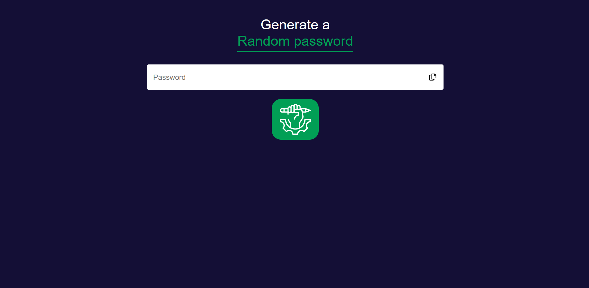

<h1 align="center"> Password Generator </h1>

Programa com a finalidade de criar passwords seguras cumprindo com os requisitos de uma password forte. 

  

## 🚀 Tecnologias

Esse projeto foi desenvolvido com as seguintes tecnologias:

- HTML e CSS
- JavaScript
- Git e Github
